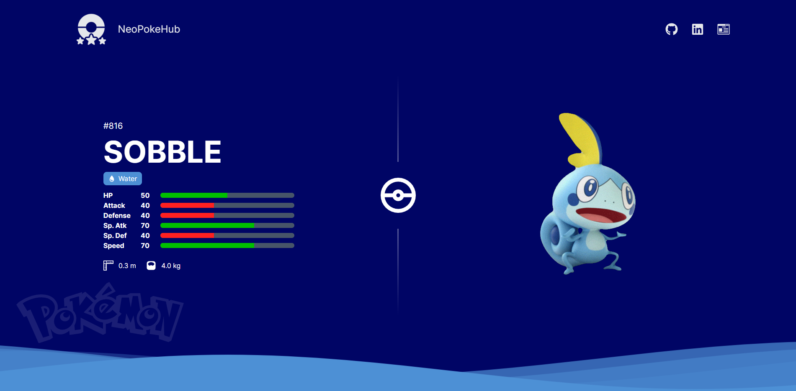

# NeoPokeHub

## Live Demo

https://neopokehub.netlify.app/

## Summary

NeoPokeHub provides an elegantly streamlined experience for trainers in search of detailed Pokemon information.

## To Do

- Add pagination
- Break components down further and organize tests better
- Clean up code
- Improve animations
- Add Who's that Pokemon minigame

## Languages and Technologies

- TypeScript
- React
- Next.js
- Tailwind CSS
- Jest
- React Testing Library

## Techniques

- Test-driven Development with unit tests
- Server-side Rendering

## Attribution

This design was heavily inspired by https://github.com/carlosdancr

## License

Licensed under the [MIT License](LICENSE)
